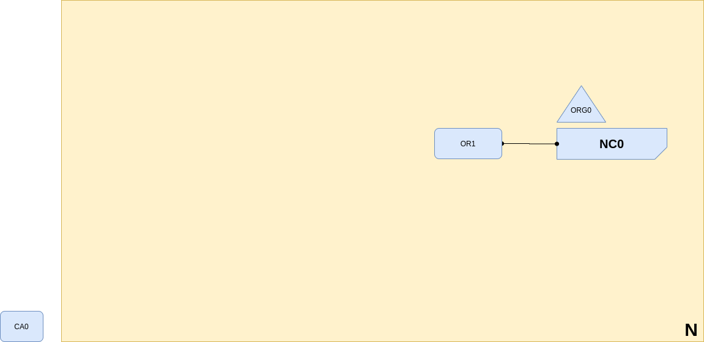

<br />
<p align="center">
  <a>
    
  </a>

  <h3 align="center">Learn-Fabric</h3>

  <p align="center">
    Lab 01: Network With only system channel
</p>

# More about Lab

Using certifacts generated by CA, servers start a fabric network with only system channel having a solo orderer. 

<p align="left">
  <a>
    
  </a>
</p>

# Steps

### Start root tls ca server (tlsca) 
tlsca  will be responsible for signing all certifacts required for secure communication between fabric components.
```
  bash docker/start.sh tlsca
```
In order to communicate with tlsca server we will have to get server's tls certifacts.
```
  cd organizations/tlsorg/registrar
  docker cp tls_ca:/crypto/tls-cert.pem tls-cert.pem
```
To add new identity to tlsca, we would need its registrar keys and certifacts
```
  fabric-ca-client enroll -u https://registrar:pw@localhost:7054 -H . --tls.certfiles tls-cert.pem
```
Register following identities with tlsca
  - ID : org0_orderer1 ; Type : orderer
```
  fabric-ca-client identity add org0_orderer1 --type orderer --secret pw -H . --tls.certfiles tls-cert.pem
```
### Start root org ca server (org0ca) 
org0ca  will be responsible for signing all certifacts required for cryptographic validation of memebers inside fabric network
```
  bash docker/start.sh org0ca
```
In order to communicate with org0ca server we will have to get server's tls certifacts.
```
  cd organizations/org0/registrar
  docker cp org0_ca:/crypto/tls-cert.pem tls-cert.pem
```
To add new identity to org0ca, we would need its registrar keys and certifacts
```
  fabric-ca-client enroll -u https://registrar:pw@localhost:8054 -H . --tls.certfiles tls-cert.pem
```
Register following identities with tlsca
  - ID : orderer1 ; Type : orderer
  - ID : admin ; Type : admin
```
  fabric-ca-client identity add orderer1 --type orderer --secret pw -H . --tls.certfiles tls-cert.pem
  fabric-ca-client identity add admin --type admin --secret pw -H . --tls.certfiles tls-cert.pem
```
### Enroll certifacts
for msp
```
  fabric-ca-client enroll -u https://<id>:<secret>@localhost:<running_port_ca> -H . -M msp --tls.certfiles <path_of_ca_tls_cert>
```
for tls 
```
  fabric-ca-client enroll -u https://<id>:<secret>@localhost:<running_port_ca> -H . -M tls --tls.certfiles <path_of_ca_tls_cert> --csr.hosts <host_of_identity> --enrollment.profile tls
```
* [For more infformation](https://hyperledger-fabric-ca.readthedocs.io/en/release-1.4/operations_guide.html#setup-org1-s-peers)
### Folder trees
1. msp of memebers
```
msp/
├── cacerts
│   └── cacert.pem
├── config.yaml
├── keystore
│   └── key.pem
└── signcerts
    └── cert.pem
```
2. tls
```
tls/
├── ca.crt
├── server.crt
└── server.key
```
3. msp of org
```
msp/
├── admincerts
├── cacerts
│   └── cacert.pem
├── config.yaml
└── tlscacerts
    └── ca.crt
```

* [for more information about folder Structure](https://hyperledger-fabric.readthedocs.io/en/release-2.2/msp.html#msp-setup-on-the-peer-orderer-side)

### Generate genesis.block using configtxgen
```
configtxgen -outputBlock artifacts/genesis.block -channelID ordererchannel -profile BootUp
```

### Start orderer
```bash docker/start.sh org0_orderer1```