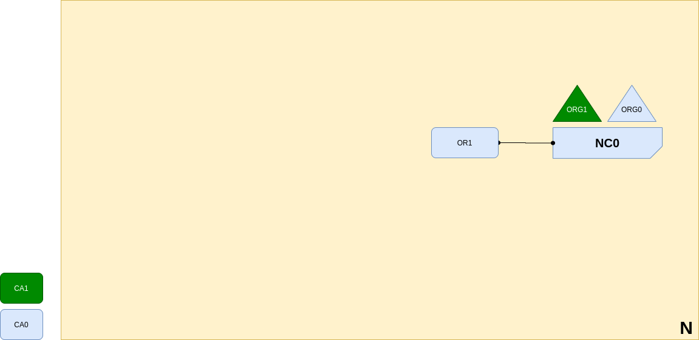

<br />
<p align="center">
  <a>
    
  </a>

  <h3 align="center">Learn-Fabric</h3>

  <p align="center">
    Lab 02: Adding Network Administrators
</p>

# More about Lab
*Organization ORG0 updates the network configuration to make organization ORG1 an administrator too. After this point ORG1 and ORG0 have equal rights over the network configuration.*
<p align="left">
  <a>
    
  </a>
</p>

# Steps

### Start Org1's ca server (CA0)
```
  bash docker/start.sh org1ca
```
To add new identity to CA0, we would need its registrar keys and certifacts
```
  bash scripts/enroll.sh <id> <ca_port> organizations/<org_folder_path>/
  bash scripts/enroll.sh registrar 8054 organizations/org1/
```
Register following identities
  - ID : admin ; Type : admin
```
  bash scripts/register.sh <id> <type> <path_of_registrar>
  bash scripts/register.sh admin admin organizations/org1/registrar/
```
### Enroll certifacts
```
  bash scripts/enroll.sh admin 8054 organizations/org1
```

### Check
Check is org1 admin able to Permaform admin opertion on NC0<br>
#### Fetch config block using org1's admin
1. Set env to org1's admin
```
. terminals/org1.sh
```
2. Fetch config block
```
peer channel fetch config config_block.pb -o localhost:7050 -c ordererchannel
```
Output
```
[channelCmd] InitCmdFactory -> INFO 001 Endorser and orderer connections initialized
[cli.common] readBlock -> INFO 002 Expect block, but got status: &{FORBIDDEN}
```

# Steps

### Setup Org1's msp folder
1. Folder structure should be
```
organizations/org1/msp/
├── cacerts
│   └── cacert.pem
└── config.yaml
```
2. Print Org1
```
configtxgen -printOrg Org1 > channel_updates/org1.json
```
3. Fetch ordererchannel config block using org0 admin certs
```
. terminals/org0.sh
peer channel fetch config channel_updates/config_block.pb -o localhost:7050 -c ordererchannel
cd channel_updates
```
4. convert config block protocol buffer to a json format (trimmed)
```
configtxlator proto_decode --type common.Block --input config_block.pb | jq .data.data[0].payload.data.config > config.json
```
5. Add org1.json to config.json and return *modified_config.json* 
```
jq -s '.[0] * {"channel_group":{"groups":{"Orderer":{"groups":{"Org1":.[1]}}}}}' config.json org1.json > modified_config.json
```
6. compute delta
```
configtxlator proto_encode --input config.json --type common.Config --output config.pb

configtxlator proto_encode --input modified_config.json --type common.Config --output modified_config.pb

configtxlator compute_update --channel_id ordererchannel --original config.pb --updated modified_config.pb --output config_update.pb
```
7. Re-Encode
```
configtxlator proto_decode --input config_update.pb --type common.ConfigUpdate --output config_update.json

echo '{"payload":{"header":{"channel_header":{"channel_id":"ordererchannel", "type":2}},"data":{"config_update":'$(cat config_update.json)'}}}' | jq . > config_update_in_envelope.json

configtxlator proto_encode --input config_update_in_envelope.json --type common.Envelope --output config_update_in_envelope.pb
```
8. Submit channel update
```
peer channel update -f config_update_in_envelope.pb -o localhost:7050 -c ordererchannel
```
!!!!!!! DONE !!!!!!!
# Re-Check
```
. terminals/org1.sh
peer channel fetch config config_block.pb -o localhost:7050 -c ordererchannel
```
Output
```
[channelCmd] InitCmdFactory -> INFO 001 Endorser and orderer connections initialized
[cli.common] readBlock -> INFO 002 Received block: 1
[channelCmd] fetch -> INFO 003 Retrieving last config block: 1
[cli.common] readBlock -> INFO 004 Received block: 1
```