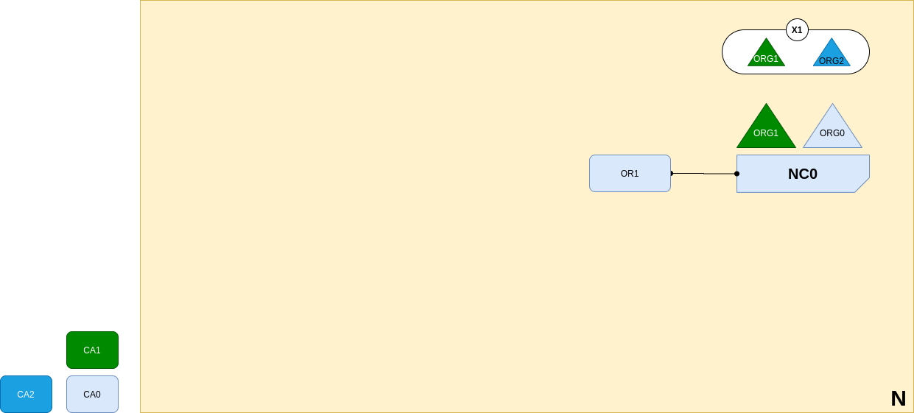

<br />
<p align="center">
  <a>
    
  </a>

  <h3 align="center">Learn-Fabric</h3>

  <a href="https://hyperledger-fabric.readthedocs.io/en/latest/network/network.html#defining-a-consortium">
  <p align="center">
  Lab 03: Defining a Consortium
  </a>
</p>

# More about Lab
*A network administrator defines a consortium X1 that contains two members, the organizations ORG1 and ORG2. This consortium definition is stored in the network configuration NC0, and will be used at the next stage of network development. CA1 and CA2 are the respective Certificate Authorities for these organizations.*
<p align="left">
  <a>
    
  </a>
</p>

# Steps
1. Start CA2 and enroll org2's resistrar
```
bash docker/start.sh org2ca
bash scripts/enroll.sh registrar 9054 organizations/org2
```
2. Folder structure should be
```
organizations/org1/msp/
├── cacerts
│   └── cacert.pem
└── config.yaml
```
3. Print Org1 and Org2
```
configtxgen -printOrg Org1 > channel_updates/org1.json
configtxgen -printOrg Org2 > channel_updates/org2.json
```
4. Fetch ordererchannel config block using org0's either org1's admin certs
```
. terminals/org1.sh
peer channel fetch config channel_updates/config_block.pb -o localhost:7050 -c ordererchannel
cd channel_updates
```
5. convert config block protocol buffer to a json format (trimmed)
```
configtxlator proto_decode --type common.Block --input config_block.pb | jq .data.data[0].payload.data.config > config.json
```
7. Add org2.json and org1.json to config.json and return *modified_config.json* 
```
jq -s '.[0] * {"channel_group" : {"groups" : {"Consortiums" : {"groups" : {"SampleConsortium" : {"groups" : {"Org1" : .[1]}}}}}}}' config.json org1.json > temp_modified_config.json
jq -s '.[0] * {"channel_group" : {"groups" : {"Consortiums" : {"groups" : {"SampleConsortium" : {"groups" : {"Org2" : .[1]}}}}}}}' temp_modified_config.json org2.json > modified_config.json
```
8. compute delta
```
configtxlator proto_encode --input config.json --type common.Config --output config.pb

configtxlator proto_encode --input modified_config.json --type common.Config --output modified_config.pb

configtxlator compute_update --channel_id ordererchannel --original config.pb --updated modified_config.pb --output config_update.pb
```
9. Wrapping it in an envelope
```
configtxlator proto_decode --input config_update.pb --type common.ConfigUpdate --output config_update.json

echo '{"payload":{"header":{"channel_header":{"channel_id":"ordererchannel", "type":2}},"data":{"config_update":'$(cat config_update.json)'}}}' | jq . > config_update_in_envelope.json

configtxlator proto_encode --input config_update_in_envelope.json --type common.Envelope --output config_update_in_envelope.pb
```
10. Sign Envelope
```
peer channel signconfigtx -f config_update_in_envelope.pb
```
11. Submit Channel Update
```
. ../terminals/org0.sh
peer channel update -f config_update_in_envelope.pb -o localhost:7050 -c ordererchannel
```
!!!!!!! DONE !!!!!!!