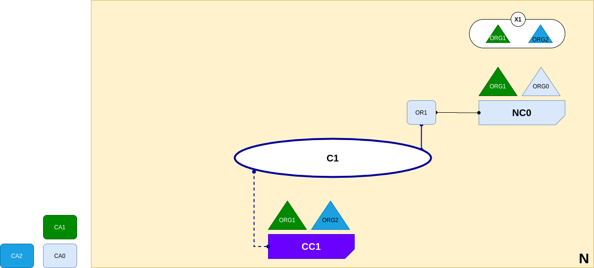

<br />
<p align="center">
  <a>
    
  </a>

  <h3 align="center">Learn-Fabric</h3>

  <a href="https://hyperledger-fabric.readthedocs.io/en/latest/network/network.html#creating-a-channel-for-a-consortium">
  <p align="center">
  Lab 04: Creating a channel for a consortium
  </a>
</p>

# More about Lab
*A channel C1 has been created for ORG1 and ORG2 using the consortium definition X1. The channel is governed by a channel configuration CC1, completely separate to the network configuration. CC1 is managed by ORG1 and ORG2 who have equal rights over C1. ORG0 has no rights in CC1 whatsoever.*
<p align="left">
  <a>
    
  </a>
</p>

# Steps
1. Add Following lines under profile section of configtx.yaml file
```
  Org1AndOrg2Channel:
    Consortium: SampleConsortium
    <<: *ChannelConfig
    Application:
      <<: *ApplicationConfig
      Organizations:
        - *Org1
        - *Org2
```
2. Generate firstchannel.tx
```
configtxgen -outputCreateChannelTx artifacts/firstchannel.tx -profile Org1AndOrg2Channel -channelID firstchannel
```