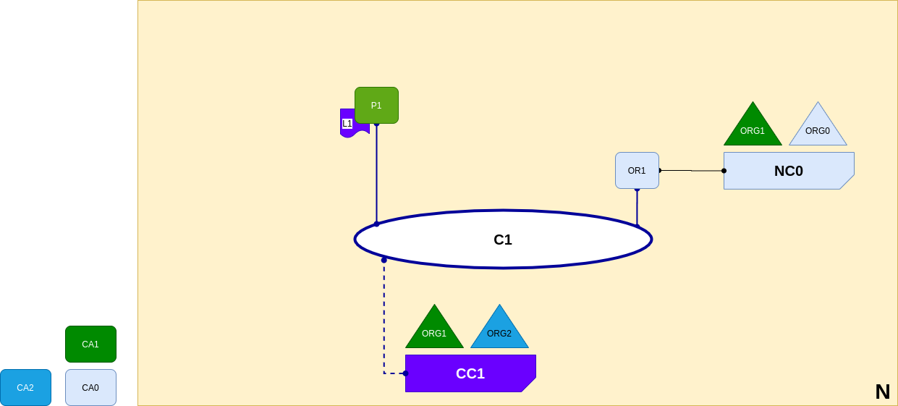

<br />
<p align="center">
  <a>
    
  </a>

  <h3 align="center">Learn-Fabric</h3>

  <a href="https://hyperledger-fabric.readthedocs.io/en/latest/network/network.html#peers-and-ledgers">
  <p align="center">
  Lab 05: Peers and Ledgers
  </a>
</p>

# More about Lab
*A peer node P1 has joined the channel C1. P1 physically hosts a copy of the ledger L1. P1 and OR1 can communicate with each other using channel C1.*
<p align="left">
  <a>
    
  </a>
</p>

# Steps

1. Register and enroll P1 (peer1) of org1
```
    bash scripts/register.sh peer1 peer organizations/org1/registrar
    bash scripts/enroll.sh peer1 8054 organizations/org1
```
2. Start Peer1
```
  bash docker/start.sh org1_peer1
```
3. Create firstchannel and join
```
. terminals/org1.sh
peer channel create -f artifacts/firstchannel.tx -o localhost:7050 -c firstchannel
peer channel join -b firstchannel.block
```

!!!!!! DONE !!!!!!!