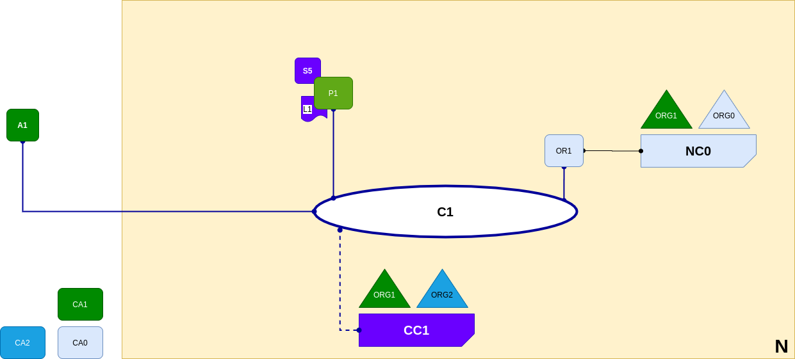

<br />
<p align="center">
  <a>
    
  </a>

  <h3 align="center">Learn-Fabric</h3>

  <a href="https://hyperledger-fabric.readthedocs.io/en/latest/network/network.html#applications-and-smart-contract-chaincode">
  <p align="center">
  Lab 06: Applications and Smart Contract chaincode
  </a>
</p>

# More about Lab
*A smart contract S5 has been installed onto P1. cli A1 in organization ORG1 can use S5 to access the ledger via peer node P1. A1, P1 and OR1 are all joined to channel C1, i.e. they can all make use of the communication facilities provided by that channel.*
<p align="left">
  <a>
    
  </a>
</p>

# Steps
1. Package chaincode
```
 . terminals/org1.sh 
  peer lifecycle chaincode package channel_updates/abc_1.0.tar.gz -p chaincodes/abc --label abc
```
2. Install chaincode
```
  peer lifecycle chaincode install channel_updates/abc_1.0.tar.gz
```
3. Approve for the chaincode
```
peer lifecycle chaincode approveformyorg -C firstchannel --init-required -n abc --package-id <package_id> --sequence 1 -v 1.0 -o localhost:7050 --signature-policy 'OR("Org1MSP.peer")'
```
4. commit chaincode
```
peer lifecycle chaincode commit -C firstchannel --init-required -n abc --sequence 1 -v 1.0 -o localhost:7050 --signature-policy 'OR("Org1MSP.peer")'
```
OHH!!! Wait An Error
```
[chaincodeCmd] ClientWait -> INFO 001 txid [eafe6788daa485df191b9d5ccad2871675620cf156b87bfa198174cac2c7d3f5] committed with status (ENDORSEMENT_POLICY_FAILURE) at localhost:8051
Error: transaction invalidated with status (ENDORSEMENT_POLICY_FAILURE)
```

# Diagnosis Mode ON
The error talk about **ENDORSEMENT_POLICY_FAILURE**; [Policies section of Org1](https://github.com/Zzocker/fabric-labs/blob/b6148213ca694ea7fffd19d4e84cfec5b67467fb/configtx.yaml#L20)<br>
There is no *Endorsement* policie for Org1; which means we will have to add this policie and update the channel.
## Steps
1. Fetch the latest config and Decode
```
  peer channel fetch config channel_updates/config_block.pb -o localhost:7050 -c firstchannel
  configtxlator proto_decode --type common.Block --input config_block.pb | jq .data.data[0].payload.data.config > config.json
```
2. Create endorsement_update.json
```
  jq .channel_group.groups.Application.groups.Org1.policies.Admins config.json > endorsement.json
  jq '.policy.value.identities[0].principal.role = "PEER"' endorsement.json > endorsement_update.json
```
3. Create Envelope
```
jq -s '.[0] * {"channel_group" : {"groups":{"Application" : {"groups" : {"Org1" : {"policies" :{"Endorsement" : .[1]}}}}}}}' config.json endorsement_update.json > modified_config.json

configtxlator proto_encode --input config.json --type common.Config --output config.pb

configtxlator proto_encode --input modified_config.json --type common.Config --output modified_config.pb

configtxlator compute_update --channel_id firstchannel --original config.pb --updated modified_config.pb --output config_update.pb

configtxlator proto_decode --input config_update.pb --type common.ConfigUpdate --output config_update.json

echo '{"payload":{"header":{"channel_header":{"channel_id":"firstchannel", "type":2}},"data":{"config_update":'$(cat config_update.json)'}}}' | jq . > config_update_in_envelope.json

configtxlator proto_encode --input config_update_in_envelope.json --type common.Envelope --output config_update_in_envelope.pb
```
4. Update Channel
```
  peer channel update -f config_update_in_envelope.pb -o localhost:7050 -c firstchannel
```
# Try Committing the chaincode again
# Invoke Chaincode
Since we committed chaincode with *--init-required* args
```
peer chaincode invoke -C firstchannel -n abc -I -c '{"args":["init","a","100","b","100"]}' -o localhost:7050
```
# Query Chaincode
```
peer chaincode query -C firstchannel -n abc -c '{"args":["query","a"]}'
```