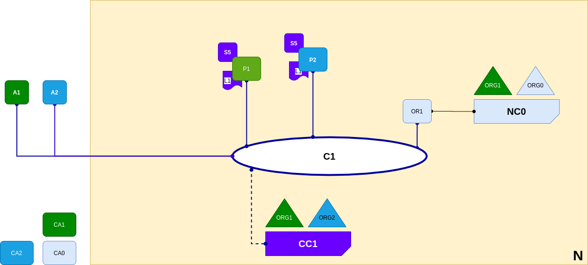

<br />
<p align="center">
  <a>
    
  </a>

  <h3 align="center">Learn-Fabric</h3>

  <a href="https://hyperledger-fabric.readthedocs.io/en/latest/network/network.html#network-completed">
  <p align="center">
  Lab 07: Network completed
  </a>
</p>

# More about Lab
*The network has grown through the addition of infrastructure from organization ORG2. Specifically, ORG2 has added peer node P2, which hosts a copy of ledger L1, and chaincode S5. ORG2 approves the same chaincode definition as ORG1. P2 has also joined channel C1, as has cli A2. A2 and P2 are identified using certificates from CA2. All of this means that both cli A1 and A2 can invoke S5 on C1 either using peer node P1 or P2.*
<p align="left">
  <a>
    
  </a>
</p>

# Steps
1. Register and enroll P1
```
bash scripts/register.sh peer1 peer organizations/org2/registrar
bash scripts/enroll.sh peer1 9054 organizations/org2
```
2. Start P1
```
bash docker/start.sh org2_peer1
```
3. Join The channel
```
peer channel fetch 0 firstchannel.block -o localhost:7050 -c firstchannel
peer channel join -b firstchannel.block
```
3. Install and approve chaincode
```
  peer lifecycle chaincode install channel_updates/abc_1.0.tar.gz

  peer lifecycle chaincode approveformyorg -C firstchannel --init-required -n abc --package-id <package_id> --sequence 1 -v 1.0 -o localhost:7050 --signature-policy 'OR("Org1MSP.peer")'
```
4. Testing
```
peer chaincode invoke -n abc -C firstchannel -c '{"args":["add","d","120"]}' -o localhost:7050 --waitForEvent --peerAddresses localhost:8051

peer chaincode query -C firstchannel -n abc -c '{"args":["query","d"]}'
```