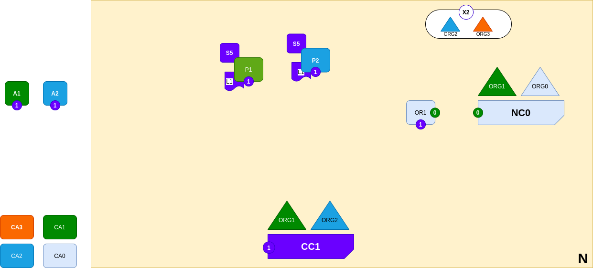

<br />
<p align="center">
  <a>
    
  </a>

  <h3 align="center">Learn-Fabric</h3>

  <a href="https://hyperledger-fabric.readthedocs.io/en/latest/network/network.html#adding-another-consortium-definition">
  <p align="center">
  Lab 08: Adding another consortium definition
  </a>
</p>

# More about Lab
*A network administrator from organization ORG1 and ORG0 has added a new consortium definition, X2, which includes organizations ORG2 and ORG3. This will be used to define a new channel for X2.*
<p align="left">
  <a>
    
  </a>
</p>

# Steps
1. Start CA3 and enroll registrar
```
  bash docker/start.sh org3ca
  bash scripts/enroll.sh registrar 10054 organizations/org3/
```
2. Setup Org3 MSP; Folder structure should be
```
organizations/org1/msp/
├── cacerts
│   └── cacert.pem
└── config.yaml
```
3. Print Org3 and Org2
```
  configtxgen -printOrg Org3 > channel_updates/org3.json
  configtxgen -printOrg Org2 > channel_updates/org2.json
```
4. Create Envelope
```
. terminals/org1.sh
cd channel_updates
peer channel fetch config config_block.pb -o localhost:7050 -c ordererchannel

configtxlator proto_decode --input config_block.pb --type common.Block | jq .data.data[0].payload.data.config > config.json

jq -s '.[0] * {"channel_group":{"groups":{"Consortiums":{"groups":{"NotSoSimpleConsortium": .[1] }}}}}' config.json ../default_consortium.json > default_consortium_update.json

jq -s '.[0] * {"channel_group":{"groups":{"Consortiums":{"groups":{"NotSoSimpleConsortium": {"groups":{"Org2" : .[1],"Org3" : .[2]}}}}}}}' default_consortium_update.json org2.json org3.json > modified_config.json

configtxlator proto_encode --input config.json --type common.Config --output config.pb

configtxlator proto_encode --input modified_config.json --type common.Config --output modified_config.pb

configtxlator compute_update --channel_id ordererchannel --original config.pb --updated modified_config.pb --output config_update.pb

configtxlator proto_decode --input config_update.pb --type common.ConfigUpdate --output config_update.json

echo '{"payload":{"header":{"channel_header":{"channel_id":"ordererchannel", "type":2}},"data":{"config_update":'$(cat config_update.json)'}}}' | jq . > config_update_in_envelope.json

configtxlator proto_encode --input config_update_in_envelope.json --type common.Envelope --output config_update_in_envelope.pb
```
5. Sign Envelope
```
peer channel signconfigtx -f config_update_in_envelope.pb
```
6. Submit Channel Update
```
. ../terminals/org0.sh
peer channel update -f config_update_in_envelope.pb -o localhost:7050 -c ordererchannel
```

!!!!!!! DONE !!!!!!!!!!!!