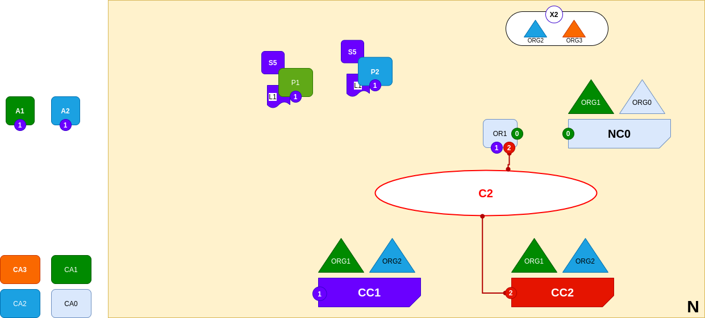

<br />
<p align="center">
  <a>
    
  </a>

  <h3 align="center">Learn-Fabric</h3>

  <a href="https://hyperledger-fabric.readthedocs.io/en/latest/network/network.html#adding-a-new-channel">
  <p align="center">
  Lab 09: Adding a new channel
  </a>
</p>

# More about Lab
*A new channel C2 has been created for R2 and R3 using consortium definition X2. The channel has a channel configuration CC2, completely separate to the network configuration NC4, and the channel configuration CC1. Channel C2 is managed by R2 and R3 who have equal rights over C2 as defined by a policy in CC2. R1 and R4 have no rights defined in CC2 whatsoever.*
<p align="left">
  <a>
    
  </a>
</p>

# Steps
1. Add Following lines under profile section of configtx.yaml file
```
  Org2AndOrg3Channel:
    Consortium: NotSoSimpleConsortium
    <<: *ChannelConfig
    Application:
      <<: *ApplicationConfig
      Organizations:
        - *Org2
        - *Org3
```
2. Generate secondchannel.tx
```
configtxgen -outputCreateChannelTx artifacts/secondchannel.tx -profile Org2AndOrg3Channel -channelID secondchannel
```