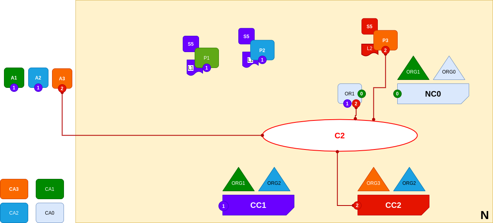

<br />
<p align="center">
  <a>
    
  </a>

  <h3 align="center">Learn-Fabric</h3>

  <a href="https://hyperledger-fabric.readthedocs.io/en/latest/network/network.html#adding-another-peer">
  <p align="center">
  Lab 10: Adding another peer
  </a>
</p>

# More about Lab
*The diagram shows the facts relating to channels C1 and C2 in the network N as follows: Client cli A1 and A2 can use channel C1 for communication with peers P1 and P2, and ordering service OR1; client cli A3 can use channel C2 for communication with peer P3 and ordering service OR1. Ordering service OR1 can make use of the communication services of channels C1 and C2. Channel configuration CC1 applies to channel C1, CC2 applies to channel C2.*
<p align="left">
  <a>
    
  </a>
</p>

# Steps

1. Register and enroll P1 (peer1) of org3
```
    bash scripts/register.sh peer1 peer organizations/org3/registrar
    bash scripts/enroll.sh peer1 10054 organizations/org3
```
2. Start Peer1
```
  bash docker/start.sh org3_peer1
```
3. Create secondchannel and join
```
bash scripts/register.sh admin admin organizations/org3/registrar

bash scripts/enroll.sh admin 10054 organizations/org3

. terminals/org3.sh
peer channel create -f artifacts/secondchannel.tx -o localhost:7050 -c secondchannel
peer channel join -b secondchannel.block 
```
4. Package chaincode {for simplicity we will be using same chaincode but with different label sabc => second abc}
```
  peer lifecycle chaincode package channel_updates/sabc_1.0.tar.gz -p chaincodes/abc --label sabc
```
5. Install chaincode
```
  peer lifecycle chaincode install channel_updates/sabc_1.0.tar.gz
```
6. Approve for the chaincode
```
peer lifecycle chaincode approveformyorg -C secondchannel --init-required -n sabc --package-id <package_id> --sequence 1 -v 1.0 -o localhost:7050
```
7. Check if chaincode is ready to committed
```
peer lifecycle chaincode checkcommitreadiness -C secondchannel --init-required -n sabc  --sequence 1 -v 1.0 -o localhost:7050 -O json
```
OUTPUT
```
{
        "approvals": {
                "Org2MSP": false,
                "Org3MSP": true
        }
}
```
8. Approve chaincode for Org2
```
. terminals/org2.sh

peer channel join -b secondchannel.block

peer lifecycle chaincode approveformyorg -C secondchannel --init-required -n sabc --sequence 1 -v 1.0 -o localhost:7050
```
9. commit chaincode
```
peer lifecycle chaincode commit -C secondchannel --init-required -n sabc --sequence 1 -v 1.0 -o localhost:7050
```
ERROR OUTPUT
```
ClientWait -> INFO 001 txid [00a753d59061a4a40058a3d602077e47c43d80932edfb3e622f0b5e2ba030596] committed with status (ENDORSEMENT_POLICY_FAILURE) at localhost:10051
Error: transaction invalidated with status (ENDORSEMENT_POLICY_FAILURE)
```
# Diagnosis Mode ON
Since **Endorsement** policie of application is set to **MAJORITY**, we would need 
commit **Endorsement** from peers of both Orgs (Org2 And Org3)<br>
Solutions :
* Chanage **Endorsement** to "ANY" and update channel.(Try yourself) or
* Install chaincode on org2's peer also (will do in next lab)