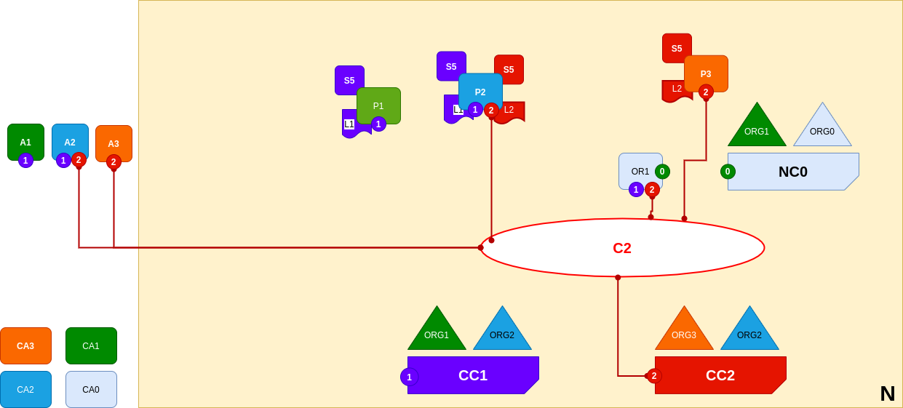

<br />
<p align="center">
  <a>
    
  </a>

  <h3 align="center">Learn-Fabric</h3>

  <a href="https://hyperledger-fabric.readthedocs.io/en/latest/network/network.html#joining-a-peer-to-multiple-channels">
  <p align="center">
  Lab 11: Joining a peer to multiple channels
  </a>
</p>

# More about Lab
*The diagram shows the facts relating to channels C1 and C2 in the network N as follows: Client cli A1 can use channel C1 for communication with peers P1 and P2, and ordering service OR1; cli A2 can use channel C1 for communication with peers P1 and P2 and channel C2 for communication with peers P2 and P3 and ordering service OR1; cli A3 can use channel C2 for communication with peer P3 and P2 and ordering service OR1. Ordering service OR1 can make use of the communication services of channels C1 and C2. Channel configuration CC1 applies to channel C1, CC2 applies to channel C2.*
<p align="left">
  <a>
    
  </a>
</p>

# Steps
1. install chaincode on Peer2
```
  . terminals/org2.sh 

  peer lifecycle chaincode install channel_updates/sabc_1.0.tar.gz
```
2. commit chaincode
```
peer lifecycle chaincode commit -C secondchannel --init-required -n sabc --sequence 1 -v 1.0 -o localhost:7050 --peerAddresses localhost:9051 --peerAddresses localhost:10051
```
ERROR OUTPUT
```
[chaincodeCmd] ClientWait -> INFO 001 txid [19af68dda6be6312a0f16dde9314554d886ca42885fcd6494d56bb021abde33d] committed with status (ENDORSEMENT_POLICY_FAILURE) at localhost:10051
[chaincodeCmd] ClientWait -> INFO 002 txid [19af68dda6be6312a0f16dde9314554d886ca42885fcd6494d56bb021abde33d] committed with status (ENDORSEMENT_POLICY_FAILURE) at localhost:9051
Error: transaction invalidated with status (ENDORSEMENT_POLICY_FAILURE)
```
**SAME ERROR AS [LAB06](lab06.md)**

3. TRY again
Output
```
[chaincodeCmd] ClientWait -> INFO 001 txid [b077b1b0afc5cefb0989328b41a3e85228ea8116d695c108aebe70593393f94b] committed with status (VALID) at localhost:10051
[chaincodeCmd] ClientWait -> INFO 002 txid [b077b1b0afc5cefb0989328b41a3e85228ea8116d695c108aebe70593393f94b] committed with status (VALID) at localhost:9051
```
